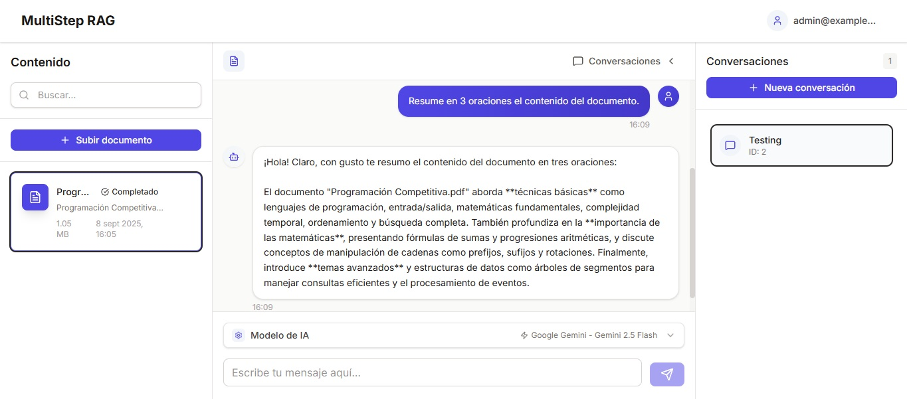

# Multi-Step RAG Application

A full-stack application implementing multi-step Retrieval Augmented Generation (RAG) with a FastAPI backend and a React frontend interface.

## Features

- 🔍 Multi-step retrieval process
- 🤖 Advanced language model integration
- 📊 Interactive React frontend
- 🐳 Docker containerization
- 📈 Real-time query processing

## Screenshots



## Backend

The backend is built with FastAPI and implements the RAG pipeline.

### Setup

1. Navigate to the backend directory:

```bash
cd backend
```

2. Install dependencies:

```bash
pip install -r requirements.txt
```

3. Setup environment variables:

```env
# Database configuration
DATABASE_USER=postgres
DATABASE_PASSWORD=postgres
DATABASE_HOST=localhost
DATABASE_PORT=5432
DATABASE_NAME=multistep_rag

# API configuration
SECRET_KEY=your-secret-key
ALGORITHM=HS256
ACCESS_TOKEN_EXPIRE_MINUTES=43200
DATETIME_FORMAT=%Y-%m-%d %H:%M:%S

# LLM configuration
OPENAI_API_KEY=your-openai-api-key
GOOGLE_API_KEY=your-google-genai-api-key

# ChromaDB
CHROMA_HOST=localhost
CHROMA_PORT=8001
```

4. Run the development server:

```bash
python run.py
```

The API will be available at `http://localhost:8000` by default. API documentation can be accessed at:

- Swagger UI: `http://localhost:8000/docs`
- ReDoc: `http://localhost:8000/redoc`

## Frontend

The frontend is built with React + Vite and Tailwind CSS, provides a user interface for interacting with the RAG system.

### Setup

1. Navigate to the frontend directory:

```bash
cd frontend
```

2. Install dependencies:

```bash
npm install
```

3. Setup environment variables:

```env
VITE_API_URL=http://localhost:8000
```

4. Start the development server:

```bash
npm start
```

The frontend will be available at <http://localhost:3000> by default.

4. Building for Production

```bash
npm run build
```

## Docker Deployment

The application includes Docker configuration for easy deployment using Docker Compose.

### Prerequisites

- Docker
- Compose

### Running with Docker Compose

1. Clone the repository and navigate to the project root directory
2. Create a .env file in the root directory with your environment variables
3. Build and start all services:

```bash
docker-compose up --build
```

4. For production deployment:

```bash
docker-compose -f docker-compose.prod.yml up --build -d
```

## License

This project is licensed under the MIT License - see the LICENSE file for details.
